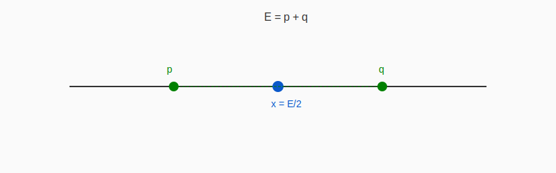

# The Goldbach Window — A Robust, Constructive Route to Two Primes

**Status:** Public preprint  
**Author:** Bahbouhi Bouchaib (Independent Scientist)

---

## Description
This repository presents a constructive Goldbach Window:  
for every large even number E = 2x, a short logarithmic-size list of offsets t — ranked by a scoring function Σ** — reliably contains a prime pair (x − t, x + t).

The method combines local congruence geometry (Σ_dense), a tempered Hardy–Littlewood lift, and a light two-column Selberg-style refinement.  
Stress-style tests (primorial/CRT) indicate the window remains short and robust.

---

## Main article
The full explanation, methodology, and proof-minded outline are available in the file:  
👉 [goldbach_window_article.md](goldbach_window_article.md)

---

## Repository guide
- [README.md](README.md) — this summary file, first entry point.  
- [goldbach_window_article.md](goldbach_window_article.md) — the detailed article.  
- [index.html](index.html) — a simple web page (for GitHub Pages).  
- [banner.svg](banner.svg) — banner illustration.  
- [window_illustration.svg](window_illustration.svg) — schematic illustration of the Goldbach Window.  
- [prime_pair_symmetric.svg](prime_pair_symmetric.svg) — illustration of symmetric Goldbach pairs.

---

## How to use
1. Start by reading [README.md](README.md) (this file).  
2. Continue with the main article: [goldbach_window_article.md](goldbach_window_article.md).  
3. (Optional) Enable GitHub Pages (Settings → Pages) to serve `index.html` as a project page.

---

## License
This work is released under the **MIT License** with attribution required.  

- You may use, copy, modify, merge, publish, and distribute this work.  
- **Any reuse or reproduction must include clear citation of the author: Bahbouhi Bouchaib.**  
- Commercial or academic use without attribution is strictly prohibited.  

© 2025 Bahbouhi Bouchaib. All rights reserved.

---

## Illustrations
### Goldbach Window (schematic)

### Symmetric prime pair (p + q = E)

---

**One sentence:**  
The Goldbach Window turns “there exist two primes” into a short, reliable list that consistently contains them.
